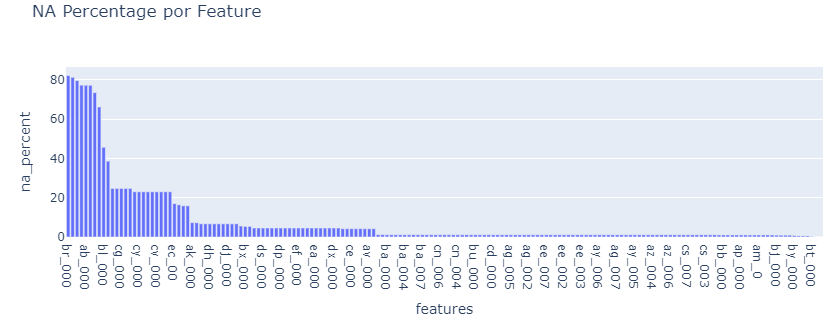
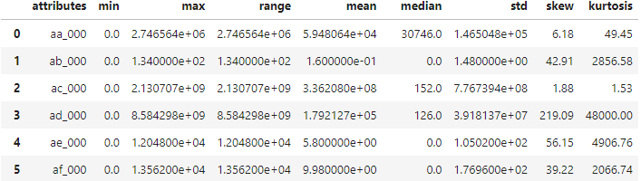
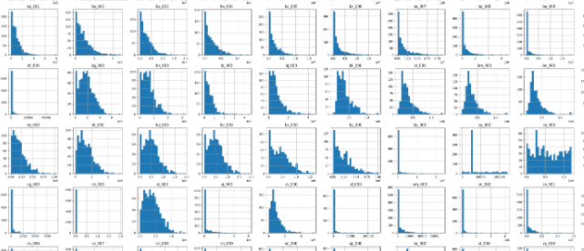
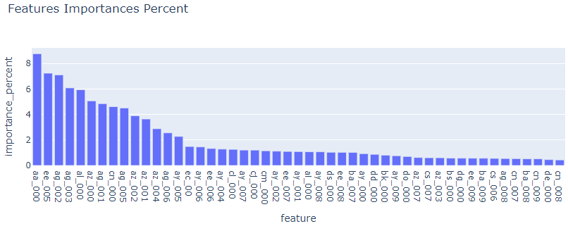
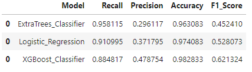
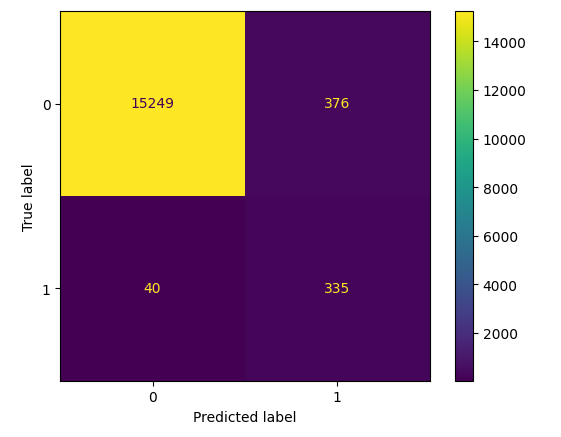
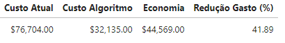

# Projeto de Previsão de Manutenção Preventiva para frota de caminhão.

## 1) Problema de Negócio
Uma empresa de transportes identificou o alto crescimento do custo de manutenção no sistema de ar dos seus caminhões. O setor de IT e manutenção da empresa entrou em contato com a consultoria de Data Science para saber se há forma de desenvolver um projeto de Machine Learning (IA) para identificar preventivamente a falha, reduzir custo de manutenção corretiva e identificar os principais fatores que causam o problema.
 
**Objetivo:** Reduzir o custo de manutenção do sistema de ar dos caminhões. Desenvolver um algoritmo de Machine Learning que, ao analisar os principais indicadores de funcionamento do caminhão, possa classificar a condição como falha e antecipar problemas de quebra.
A manutenção preventiva irá reduzir significativamente o alto custo de manutenção corretiva, além de evitar a quebra inesperada do caminhão. 

## 2) Premissas de Negócio
* A Companhia Transportadora não tem nenhum sistema de planejamento de manutenção preventiva além do básico indicado pela fabricante de caminhões.

* O custo financeiro crescente identificado na manutenção do sistema de ar está relacionado às quebras, ou seja, manutenção corretiva.

* Para além do custo financeiro calculável, a falha não planejada do caminhão traz custos extras como interrupção do trabalho, atraso em entregas, multas contratuais, problemas com clientes.

* Para efeito de cálculos e comparativo de resultado, foi assumido que as respostas positivas de falha no dataset de teste são divididas em 1/3 de manutenção corretiva e 2/3 manutenção preventiva.

## 3) Estratégia de Solução

O projeto foi executado sob a metodologia de gerenciamento cíclico "Cross Industry Standard Process for Data Mining" (CRISP-DM). O CRISP-DM consiste em executar etapas para chegar a um resultado de início até o fim do problema. Todas as etapas são revisitadas a cada proposta de melhoria e execução de um próximo ciclo completo. Define-se a solução final de acordo com os resultados e a avaliação de negócio. 

As principais vantagens são: elaborar uma versão end-to-end ao final de cada ciclo; ganhar velocidade na entrega de solução; e conseguir mapear junto a outros times da empresa possíveis melhorias a serem implementadas na próxima iteração.

O primeiro ciclo de entrega deste projeto será explicado de acordo com as questões propostas.

### Etapas CRISP-DM:

**1.** Entendimento de negócio:

* Recebimento de uma requisição, mapeamento dos processos, definição do problema, identificar a causa raiz, os principais stakeholders e uma possível solução.

**2.** Coleta dos dados:

* Base de dados entregue pela empresa contratante.

**3.** Análise Exploratória dos Dados:

* Carregar base de dados de treino. Entender os principais atributos do dataset. O dataset possui alta dimensionalidade e uma das principais tarefas da EDA será diminuir o número de features para que o algoritmo de machine learning possa trabalhar da melhor forma.

* Separar 80% dessa base para começar o trabalho de desenvolvimento (dados de treino). Os outros 20% (dados de validação) serão utilizados somente na etapa de validação e ajuste dos algoritmos de machine learning.

* Realizada transformação para valores 0 (‘neg’) e 1 (‘pos’) na variável resposta.

* Checar dados faltantes por cada feature. Os dados descritos como ‘na’, foram substituídos por NaN (valor numérico faltante). Modificar datatypes das colunas para float uma vez que os dados são todos numéricos. Verificar o percentual de dados faltantes em cada feature.

* Substituir os dados faltantes pelo valor de mediana de cada feature para não desequilibrar o dataset. Features com mais de 50% de dados faltantes serão removidas.

*Montar tabela com os principais índices estatísticos de cada feature: média, mediana, mínimo, máximo, range, desvio padrão, skew e kurtosis. Features com valor de desvio padrão menor que 0.05 serão descartadas por apresentarem quase nenhuma variação nos dados.

* Análise de distribuição das classes na variável resposta. Ocorrência muito maior da classe negativa. A falha no sistema de ar não é recorrente, não é “de ordem natural”, apesar de muito problemática.

* Análise da distribuição de frequência (histograma) das features em relação à cada classe. 

*Análise da relação de colineraridade entre as variáveis. Apesar do gráfico não ter resolução muito boa, é possível notar pelas cores muitas variáveis colineares. Insight: muitas variáveis estão correlacionadas na explicação do fenômeno, o que pode superestimar a importância dessas variáveis em relação à classe positiva.

*Definido um threshold de 0,8 para eliminar aleatoriamente uma das variáveis que estejam correlacionadas..

*Feature Engineering: exclusão das features selecionadas ao longo da EDA. Features com mais de 50% de dados faltantes, features com desvio padrão menor que 0.05, features com grau de colinearidade acima de 0,8.

*De 170 features iniciais, ficam 98.

**4.** Modelagem dos dados:

* Preparação dos dados: redimensionamento das variáveis. Todo dataset foi redimensionado utilizando o StandardScaler.

* Seleção de Features relevantes com o algoritmo BorutaPy. Utiliza o conceito de seleção de features da RandomForest para diminuição da impureza em “datasets ficticios” que ele cria a partir da base de dados, para manter a variância. No resultado de cada iteração é verificado se a variável escolhida ajudou a diminuir a impureza, ou seja, se é preditiva ao problema. Foram selecionadas 49 features relevantes em ordem de importância para construção do modelo.

**5.** Algoritmos de Machine Learning:
* Preparar os dados de validação com a mesma limpezas, escala e seleção que os dados de treino foram recebendo ao longo do projeto.

* A base de dados de treino foi balanceada para que as classes alvo tenham o mesmo peso para o aprendizado. Utilizada técnica Smote, que cria dados sintéticos. Essa decisão foi tomada pela compreensão de que a falha (classe positiva) não é condição natural do fenômeno.  

* Treinar 3 modelos de algoritmos de Machine Learning: Logistic Regression, ExtraTrees Classifier e XGBoost Classifier. 

* Utilizado o método de Validação Hold-Out: para treinamento do utilizou-se dados balanceados de treino; para ajuste dos hiperparâmetros foi usado o algoritmo Optuna com verificação de métricas em cima de dados de validação para testar a capacidade de generalização do modelo.

* Optuna é um algoritmo que realiza teste em um range de valores definidos pelo usuário para cada hiperparâmetro. Em cada tentativa os valores são trocados a partir de inferência estatística de resultados e possibilidades. A métrica de refência é informada pelo usuário. 

**6.** Performance de Machine Learning
* A performance do algoritmo foi aferida em cima de dados de teste (‘present_year’). Os dados passaram por todas as transformações, reescalas e seleções que o projeto desenvolveu.

* Definido algoritmo ExtraTrees_Classifier para o projeto como melhor algoritmo na métrica Recall no conjunto de dados de treino e validação.

* A métrica técnica utilizada como referência é o Recall. A métrica prioriza acertar a maior quantidade da classe alvo dentre todas as predições para registros positivos feitas. O Recall é uma métrica que é penalizada pelo erro Falso Negativo (FN), ou seja, é importante que não ocorra FN. Quanto mais acertos da classe positiva real e menos erros da classe negativa predita melhor a métrica.

* No negócio, FN representa o maior custo financeiro de manutenção além do custo agregado de quebra inesperada. O erro Falso Positivo (FP) representa um custo financeiro menor e pode ser executado (manutenção) de forma planejada com menor impacto às operações da empresa.

**7.** Performance de Negócio
* Apresentado para o time de negócios, a matriz de confusão é possível visualizar as previsões de forma simples, acertos e erros, além de favorecer o cálculo de custo e planejamento de ações.
* A matriz de confusão é representação prática do resultado de classificação e apresenta quantidade e qualidade de erros e acertos. A métrica Recall é o cálculo entre TP (Positivos Verdadeiros positivos) / (TP+FN) apresentados nessa matriz. 

*A classificação do algoritmo representa uma economia de 42% no gasto com a manutenção no sistema de ar através da previsão da condição de falha.

**8.** Modelo em produção:

* Esse modelo não foi para produção. Sendo aprovado, deve-se programar uma classe orientada a objeto onde ficam os métodos do projeto. Também deve-se programar um método que irá acessar a classe e suas variáveis, como uma interface a quem requisitar a classe e suas variáveis. Essa API será hospedada na cloud de preferência.

* A classe é a principal propriedade intelectual em que deve-se atentar à segurança dos dados em processamento, consumo e uso de servidor, incorporação de novos dados. Programar uma API para o bot do Telegram e fazer o deploy em nuvem.

*Acompanhar as métricas em tempo real, a chegada e dinâmica de novos dados, implementação de logging e registros, Testes A/B, são formas para monitorar o desempenho do modelo programar o retreino. 

## 4) Produto final do primeiro ciclo de desenvolvimento
* Análise exploratória inicial da base de dados
* identificação das features mais relevantes para o fenômeno.
* Desenvolvimento de algoritmo de Machine Learning para classificar a classe de falha

## 5) Conclusão
Redução de 41% no gasto de manutenção.
O objetivo do projeto é criar a previsão de falhas para um plano de manutenção que evite quebras inesperadas. Foi desenvolvido um algoritmo de Machine Learning para classificar a falha do sistema de ar.
O resultado mostra a possibilidade de atuar de forma antecipada às falhas registradas, reduzindo custo de manutenção e custo de quebra, além da possibilidade de executar a manutenção de forma planejada e calculada.

## 6) Próximos Passos para o Ciclo II do CRISP
- Desenvolver um trabalho minucioso entre a relação das features relevantes e o alvo para melhor entendimento do negócio.
- Considerar outras formas para preenchimento dos dados faltantes.
- Modelar os outliers dos dados. Etapa não realizada no Ciclo I.
- Treinar outros modelos de Machine Learning como RandomForest e SVM.
- Verificar o novo desempenho da métrica escolhida e o impacto no custo da empresa.

# Predictive Maintenance Project for Truck Fleet.
## 1) Business Problem
A transportation company identified a significant increase in maintenance costs related to the air system in its trucks. The IT and maintenance department contacted a Data Science consultancy to explore the development of a Machine Learning project to proactively identify failures, reduce corrective maintenance costs, and pinpoint key factors contributing to the issue.

**Objective:** Reduce maintenance costs associated with the trucks' air system. Develop a Machine Learning algorithm that can analyze key operational indicators of the trucks, classify their condition as failure, and anticipate breakdowns. Preventive maintenance will significantly reduce high costs of corrective maintenance and prevent unexpected truck failures.

## 2) Business Assumptions
- The transportation company lacks a comprehensive preventive maintenance planning system beyond basic manufacturer recommendations.
- The identified rising financial costs in air system maintenance are primarily due to breakdowns, i.e., corrective maintenance.
- Beyond measurable financial costs, unplanned truck failures incur additional expenses such as work stoppages, delivery delays, contractual penalties, and client issues.
- For calculation and comparison purposes, it is assumed that positive responses indicating failure in the test dataset are split into 1/3 corrective maintenance and 2/3 preventive maintenance.

## 3) Solution Strategy
The project follows the Cross Industry Standard Process for Data Mining (CRISP-DM) methodology, a cyclic management approach. CRISP-DM involves iterative steps to address a business problem from inception to solution. Each cycle revisits all stages for improvements and prepares for the next iteration based on results and business evaluation.

The initial cycle delivery of this project will be explained according to the proposed questions.

CRISP-DM Stages:

**1.** Business Understanding:

* Requirement gathering, process mapping, problem definition, root cause identification, key stakeholder identification, and potential solution proposal.

**2.** Data Collection:

* Dataset provided by the contracting company.

**3.** Exploratory Data Analysis (EDA):
* Load training dataset. Understand key attributes. The dataset is high-dimensional; EDA's primary task is to reduce the number of features for optimal machine learning algorithm performance.

* Separate 80% of the dataset for initial development (training data). The remaining 20% (validation data) will be used only for model validation and adjustment.

* Transform the response variable into binary values: 0 (‘neg’) and 1 (‘pos’).

* Check missing data per feature. Replace 'na' entries with NaN (missing numeric value). Change column data types to float as all data are numeric. Assess the percentage of missing data in each feature.

* Replace missing data with the median value of each feature to maintain dataset balance. Features with more than 50% missing data are removed.

* Create a table with statistical indices for each feature: mean, median, minimum, maximum, range, standard deviation, skewness, and kurtosis. Features with a standard deviation below 0.05 are discarded due to minimal variance in data.

* Analyze class distribution in the response variable. There is a significantly higher occurrence of the negative class. Air system failure is not recurrent or naturally occurring, despite being highly problematic.

* Histogram analysis of feature frequency distribution concerning each class.

* Assess collinearity among variables. Despite resolution limitations, many variables exhibit collinearity. Insight: several variables correlate in explaining the phenomenon, potentially overestimating their importance regarding the positive class.

* Set a threshold of 0.8 to randomly eliminate one of the highly correlated variables.

* Feature Engineering: Exclude features identified during EDA. Remove features with more than 50% missing data, those with standard deviation below 0.05, and those highly collinear.
* From an initial 170 features, 98 remain.

**4.** Data Modeling:

* Data preparation: standardize variables. The entire dataset was standardized using StandardScaler.

* Select relevant features using BorutaPy algorithm. It employs the feature selection concept from RandomForest to reduce impurity in "dummy datasets" created from the base dataset, maintaining variance. 49 relevant features were selected based on their importance for model construction.

**5.** Machine Learning Algorithms:

* Prepare validation data using the same cleaning, scaling, and selection procedures as the training data throughout the project.

* Balance the training dataset to ensure equal weighting for target classes using the SMOTE technique, which generates synthetic data. This decision stems from the understanding that failure (positive class) is not a natural occurrence.

* Train 3 Machine Learning models: Logistic Regression, ExtraTrees Classifier, and XGBoost Classifier.

* Hold-Out Validation method: use balanced training data for model training; tune hyperparameters using Optuna algorithm, validating metrics on the validation data to test model generalization capability.

* Optuna algorithm tests a range of user-defined values for each hyperparameter, adjusting values statistically based on inference results and possibilities. User-provided metrics guide the process.

**6.** Machine Learning Performance:

* Evaluate algorithm performance on test data ('present_year'). The data underwent all transformations, rescaling, and selections developed during the project.

* Select ExtraTrees_Classifier algorithm as the best performer based on Recall metric on both training and validation datasets.

* Recall is the primary technical metric, emphasizing accurate classification of the highest number of true positives among all positive predictions. Recall penalizes False Negatives (FN), where minimizing FN errors is crucial. More accurate positive class predictions and fewer false negative errors improve the metric.

* In business terms, FN represents higher financial maintenance costs beyond the aggregate cost of unexpected breakdowns. False Positive (FP) errors incur lower financial costs and can be planned and executed with minimal operational disruption.

**7.** Business Performance:

* Presented to the business team, the confusion matrix visually displays predictions, successes, and errors, facilitating cost calculation and action planning.

* The confusion matrix provides a practical classification outcome representation, detailing the quantity and quality of errors and successes. The Recall metric calculates TP (True Positives) / (TP + FN) as shown in this matrix.

* The algorithm's classification results in a 42% reduction in air system maintenance costs through failure prediction.

**8.** Model Deployment:

* This model has not been deployed to production. If approved, an object-oriented class must be programmed to contain project methods. Additionally, program a method to access the class and its variables, functioning as an interface for external requests. Host this API on a preferred cloud platform.

* The class is the primary intellectual property requiring secure data handling during processing, consumption, server usage, and new data incorporation. Program an API for a Telegram bot and deploy it in the cloud.
Monitor real-time metrics, incoming data dynamics, implement logging and records, conduct A/B tests, and consider model retraining.

## 4) First Development Cycle Final Product
- Initial exploratory analysis of the dataset.
- Identification of most relevant features for the phenomenon.
- Development of a Machine Learning algorithm for failure classification.

## 5) Conclusion
41% reduction in maintenance costs achieved. 

The project's objective is to forecast failures for a maintenance plan that prevents unexpected breakdowns. A Machine Learning algorithm was developed to classify air system failures. Results demonstrate the ability to proactively address registered failures, reducing maintenance and breakdown costs, and enabling planned maintenance operations.

## 6) Next Steps for CRISP Cycle II
- Conduct detailed analysis between relevant features and targets to improve business understanding.
- Consider alternative methods for filling missing data.
- Model data outliers, an uncompleted step in Cycle I.
- Train additional Machine Learning models such as RandomForest and SVM.
- Assess the new metric performance and its impact on company costs.
